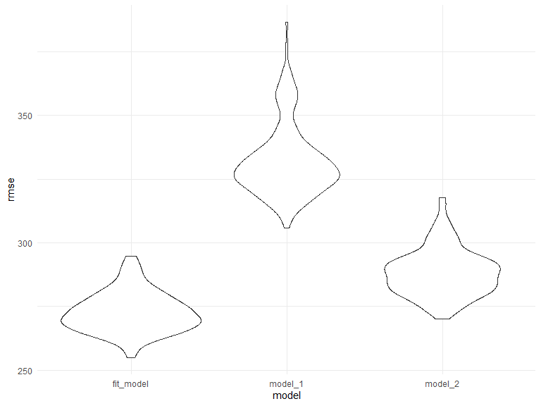

Homework 6
================
Chufeng Yang
2020-12-08

### Problem 1

``` r
homicide_df = 
  read_csv("data/homicide-data.csv", na = c("", "NA", "Unknown")) %>% 
  mutate(
    city_state = str_c(city, state, sep = ", "),
    victim_age = as.numeric(victim_age),
    resolution = case_when(
      disposition == "Closed without arrest" ~ 0,
      disposition == "Open/No arrest"        ~ 0,
      disposition == "Closed by arrest"      ~ 1)
  ) %>% 
  filter(
    victim_race %in% c("White", "Black"),
    city_state != "Tulsa, AL") %>% 
  select(city_state, resolution, victim_age, victim_race, victim_sex)
```

    ## Parsed with column specification:
    ## cols(
    ##   uid = col_character(),
    ##   reported_date = col_double(),
    ##   victim_last = col_character(),
    ##   victim_first = col_character(),
    ##   victim_race = col_character(),
    ##   victim_age = col_double(),
    ##   victim_sex = col_character(),
    ##   city = col_character(),
    ##   state = col_character(),
    ##   lat = col_double(),
    ##   lon = col_double(),
    ##   disposition = col_character()
    ## )

Start with one city.

``` r
baltimore_df =
  homicide_df %>% 
  filter(city_state == "Baltimore, MD")
glm(resolution ~ victim_age + victim_race + victim_sex, 
    data = baltimore_df,
    family = binomial()) %>% 
  broom::tidy() %>% 
  mutate(
    OR = exp(estimate),
    CI_lower = exp(estimate - 1.96 * std.error),
    CI_upper = exp(estimate + 1.96 * std.error)
  ) %>% 
  select(term, OR, starts_with("CI")) %>% 
  knitr::kable(digits = 3)
```

| term              |    OR | CI\_lower | CI\_upper |
| :---------------- | ----: | --------: | --------: |
| (Intercept)       | 1.363 |     0.975 |     1.907 |
| victim\_age       | 0.993 |     0.987 |     1.000 |
| victim\_raceWhite | 2.320 |     1.648 |     3.268 |
| victim\_sexMale   | 0.426 |     0.325 |     0.558 |

Run `glm` for each of the cities in the dataset. And extract the
adjusted odds ratio (and CI) for solving homicides comparing Black
victims to white victims.

``` r
models_results_df = 
  homicide_df %>% 
  nest(data = -city_state) %>% 
  mutate(
    models = 
      map(.x = data, ~glm(resolution ~ victim_age + victim_race + victim_sex, data = .x, family = binomial())),
    results = map(models, broom::tidy)
  ) %>% 
  select(city_state, results) %>% 
  unnest(results) %>% 
  mutate(
    OR = exp(estimate),
    CI_lower = exp(estimate - 1.96 * std.error),
    CI_upper = exp(estimate + 1.96 * std.error)
  ) %>% 
  select(city_state, term, OR, starts_with("CI"))  %>% 
  filter(term == "victim_raceWhite")
```

Create a plot that shows the estimated ORs and CIs for each city.

``` r
models_results_df %>% 
  mutate(city_state = fct_reorder(city_state, OR)) %>% 
  ggplot(aes(x = city_state, y = OR)) + 
  geom_point() + 
  geom_errorbar(aes(ymin = CI_lower, ymax = CI_upper)) + 
  theme(axis.text.x = element_text(angle = 90, hjust = 1)) +
  scale_y_continuous(limits=c(0,30), breaks=1)
```


We could find the estimated ORs and CIs for each city. And some of them,
like Albuquerque,NM or Stockton,CA, have relatively larger OR and wider
CI. Moreover, we could find that altought most of our estimated ORs are
pretty close to 1,there are more ORs’ point estimates are greater than
1, which means that when comparing Black victims to white victims,
homicides of white victims are more likely results in arrest. When
looking and CIs, some(like a half) are above 1, which means for these
cities, we might can conclude that homicides of white victims are more
likely results in arrest.

## Problem 2

### Load and clean the data for regression analysis

``` r
baby_df = 
  read_csv("./data/birthweight.csv") %>% 
  mutate(
    babysex = factor(case_when(
      babysex == 1 ~ "male",
      babysex == 2 ~ "female"
      )),
    frace = factor(case_when(
      frace == 1 ~ "White",
      frace == 2 ~ "Black",
      frace == 3 ~ "Asian",
      frace == 4 ~ "Puerto Rican",
      frace == 8 ~ "Other"
    )),
    malform = factor(case_when(
      malform == 0 ~ "absent",
      malform == 1 ~ "present"
      )),
    mrace = factor(case_when(
      mrace == 1 ~ "White",
      mrace == 2 ~ "Black",
      mrace == 3 ~ "Asian",
      mrace == 4 ~ "Puerto Rican",
      mrace == 8 ~ "Other"
    ))
  )
```

### Take a look on all variables:

``` r
baby_df %>% 
  lm(bwt~.,data = .) %>% 
  broom::tidy() 
```

    ## # A tibble: 25 x 5
    ##    term               estimate std.error statistic   p.value
    ##    <chr>                 <dbl>     <dbl>     <dbl>     <dbl>
    ##  1 (Intercept)       -6307.      659.      -9.57   1.80e- 21
    ##  2 babysexmale         -28.7       8.47    -3.39   7.02e-  4
    ##  3 bhead               131.        3.45    37.9    2.16e-271
    ##  4 blength              75.0       2.02    37.1    1.75e-261
    ##  5 delwt                 4.10      0.395   10.4    5.62e- 25
    ##  6 fincome               0.290     0.180    1.61   1.07e-  1
    ##  7 fraceBlack           -6.90     78.8     -0.0876 9.30e-  1
    ##  8 fraceOther          -16.9      97.6     -0.174  8.62e-  1
    ##  9 fracePuerto Rican   -68.2      78.5     -0.870  3.85e-  1
    ## 10 fraceWhite          -21.2      69.3     -0.306  7.59e-  1
    ## # ... with 15 more rows

### Propose a regression model for birthweight

Personally, I would like to select the model based on a data-driven
model-building process.

Given that I have never contacted with such kind of research, I choose
to apply the backward stepwise regression, which uses AIC criterion for
variable selection.

``` r
mult.fit = lm(bwt ~ .,data = baby_df)
step(mult.fit, direction='backward')
# Code result has been hidden in output file
```

The result of backward stepwise regression provide these variables:  
babysex, bhead, blength, delwt, fincome, gaweeks, mheight, mrace,
parity, ppwt, smoken  
Thus, I will take this variables as potential predictors.

My regression model:

``` r
fit_model = lm(formula = bwt ~ babysex + bhead + blength + delwt + fincome + gaweeks + mheight + mrace + parity + ppwt + smoken, data = baby_df)
```

Add residuals and predictions

``` r
fit_df = 
  baby_df %>%  
  modelr::add_residuals(fit_model) %>% 
  modelr::add_predictions(fit_model)
```

Create a plot of model residuals against fitted values

``` r
fit_df %>% 
  ggplot(aes(x = pred, y = resid)) + 
  geom_point(alpha = 0.3) +
  geom_smooth(method = "lm", color = "red", linetype = 2) + 
  labs(
    title = "Plot of model residuals against fitted values",
    x = "Predictions",
    y = "Residuals"
  )
```

    ## `geom_smooth()` using formula 'y ~ x'


 From the plot above, we could find that residuals of our model are
basically symmetrically gathered around 0. But when predictions are
relatively lower, there would be larger residuals. Meanwhile, we could
see that the predictions are not symmetrically distributed but more like
a left-skewed distribution, and even have some abnormal values(such as
predictions lower than 0), which might indicate the problems in the
model.

### Compare my model to two others

Comparing models: model 1:

``` r
model_1 = lm(bwt ~ blength + gaweeks, data = baby_df)
model_1 %>% 
  broom::tidy() %>% 
  select(term, estimate, p.value) %>% 
  knitr::kable()
```

| term        |     estimate | p.value |
| :---------- | -----------: | ------: |
| (Intercept) | \-4347.66707 |       0 |
| blength     |    128.55569 |       0 |
| gaweeks     |     27.04673 |       0 |

Model 2:

``` r
model_2 = lm(bwt ~ bhead * blength * babysex, data = baby_df)
model_2 %>% 
  broom::tidy() %>% 
  select(term, estimate, p.value) %>% 
  knitr::kable()
```

| term                      |      estimate |   p.value |
| :------------------------ | ------------: | --------: |
| (Intercept)               |  \-801.948671 | 0.4669480 |
| bhead                     |   \-16.597546 | 0.6263883 |
| blength                   |   \-21.645964 | 0.3544209 |
| babysexmale               | \-6374.868351 | 0.0001469 |
| bhead:blength             |      3.324444 | 0.0000032 |
| bhead:babysexmale         |    198.393181 | 0.0001047 |
| blength:babysexmale       |    123.772887 | 0.0004288 |
| bhead:blength:babysexmale |    \-3.878053 | 0.0002453 |

Cross Validation

``` r
set.seed(1)
cv_df =
  crossv_mc(baby_df, 200) %>% 
  mutate(
    train = map(train, as_tibble),
    test = map(test, as_tibble)
    )
```

``` r
cv_df = 
  cv_df %>% 
  mutate(
    fit_model  = map(train, ~lm(bwt ~ babysex + bhead + blength + delwt + fincome + 
    gaweeks + mheight + mrace + parity + ppwt + smoken, data = .x)),
    model_1  = map(train, ~lm(bwt ~ blength + gaweeks, data = .x)),
    model_2  = map(train, ~gam(bwt ~ bhead * blength * babysex, data = as_tibble(.x)))) %>% 
  mutate(
    rmse_fit_model  = map2_dbl(fit_model, test, ~rmse(model = .x, data = .y)),
    rmse_model_1  = map2_dbl(model_1, test, ~rmse(model = .x, data = .y)),
    rmse_model_2  = map2_dbl(model_2, test, ~rmse(model = .x, data = .y)))
```

Make a plot to show the result

``` r
cv_df %>% 
  select(starts_with("rmse")) %>% 
  pivot_longer(
    everything(),
    names_to = "model", 
    values_to = "rmse",
    names_prefix = "rmse_") %>% 
  mutate(model = fct_inorder(model)) %>% 
  ggplot(aes(x = model, y = rmse)) + geom_violin()
```



 From the plot, we could find that our model has lowest rmse, which
means that it could be the best model among these three models, and the
model 2(using head circumference, length, sex) is better than model
3(sing length at birth and gestational age as predictors). However, the
rmse value of all these three model are relatively high(rmse \> 200),
might indicate that all of them are not optimal model to predict baby’s
birth weight.

## Problem 3

### Get data

``` r
weather_df = 
  rnoaa::meteo_pull_monitors(
    c("USW00094728"),
    var = c("PRCP", "TMIN", "TMAX"), 
    date_min = "2017-01-01",
    date_max = "2017-12-31") %>%
  mutate(
    name = recode(id, USW00094728 = "CentralPark_NY"),
    tmin = tmin / 10,
    tmax = tmax / 10) %>%
  select(name, id, everything())
```

    ## Registered S3 method overwritten by 'hoardr':
    ##   method           from
    ##   print.cache_info httr

    ## using cached file: C:\Users\Aeolus\AppData\Local\cache/R/noaa_ghcnd/USW00094728.dly

    ## date created (size, mb): 2020-12-05 19:44:54 (7.552)

    ## file min/max dates: 1869-01-01 / 2020-12-31

### Bootstrap

``` r
set.seed(1)
bootstrap_results = weather_df %>% 
  modelr::bootstrap(n = 5000) %>% 
  mutate(
    models = map(strap, ~lm(tmax ~ tmin, data = .x) ),
    results = map(models, broom::tidy),
    results_glance = map(models, broom::glance)) %>% 
  unnest(results,results_glance) %>% 
  select(id = .id, term, estimate, r.squared) %>% 
  mutate(term = recode(term, '(Intercept)' = 'intercept'))
```

Have a look on the results

``` r
bootstrap_results %>% 
  head() %>% 
  knitr::kable()
```

| id   | term      | estimate | r.squared |
| :--- | :-------- | -------: | --------: |
| 0001 | intercept | 7.454152 | 0.9066105 |
| 0001 | tmin      | 1.034899 | 0.9066105 |
| 0002 | intercept | 7.358860 | 0.8958830 |
| 0002 | tmin      | 1.034589 | 0.8958830 |
| 0003 | intercept | 7.478616 | 0.9178528 |
| 0003 | tmin      | 1.040491 | 0.9178528 |

### produce estimates of r^2 and log(^β0\*^β1)

Plot the distribution of r^2

``` r
bootstrap_results %>%
    ggplot(aes(x = r.squared)) +
  geom_density() +
  labs(
    title = "Distribution of r^2",
    x = "r^2",
    y = "Density"
  )
```


 We could find that the r^2 estimates are basically
bell-shape(indicating normal distribution) and concentrate around 0.91,
and the approximate interval of r^2 is from 0.88 to 0.94, which is
relatively high and indicating that the response tmax is actually
related with the predictpr tmin.

### Calculate the log values log(^β0\*^β1)

``` r
log_df = bootstrap_results %>% 
  pivot_wider(
    names_from = term,
    values_from = estimate
  ) %>% 
  mutate(log_value = log(intercept*tmin))
```

### Plot the distribution of log(^β0\*^β1)

``` r
log_df %>% 
  ggplot(aes(x = log_value)) +
  geom_density() +
  labs(
        title = "Distribution of the log(^β0*^β1)",
        x = "log(^β0*^β1)",
        y = "Density"
    )
```


 We could find that the log(^β0\*^β1) values are basically normal
distributed in bell-shape, and concentrate around 2.01, and the
approximate interval is from 1.925 to 2.10.

### 95% confidence interval

95% CI of r^2

``` r
bootstrap_results %>% 
  summarize(
    estimate = "r^2",
    ci_lower = quantile(r.squared, 0.025), 
    ci_upper = quantile(r.squared, 0.975))%>% 
  knitr::kable()
```

| estimate | ci\_lower | ci\_upper |
| :------- | --------: | --------: |
| r^2      | 0.8936684 |  0.927106 |

95% CI of log(^β0\*^β1)

``` r
log_df %>% 
  summarize(
    estimate = "log(^β0*^β1)",
    ci_lower = quantile(log_value, 0.025), 
    ci_upper = quantile(log_value, 0.975))%>% 
  knitr::kable()
```

| estimate      | ci\_lower | ci\_upper |
| :------------ | --------: | --------: |
| log(^β0\*^β1) |  1.964949 |  2.058887 |
